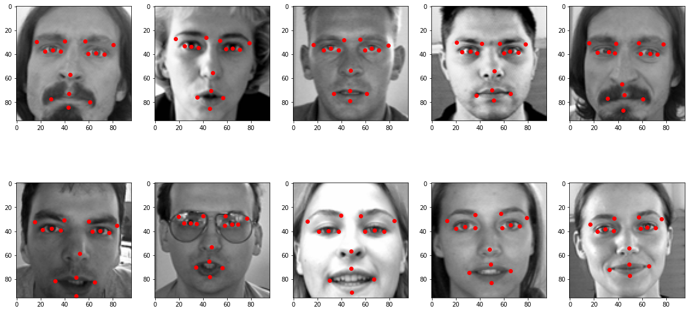
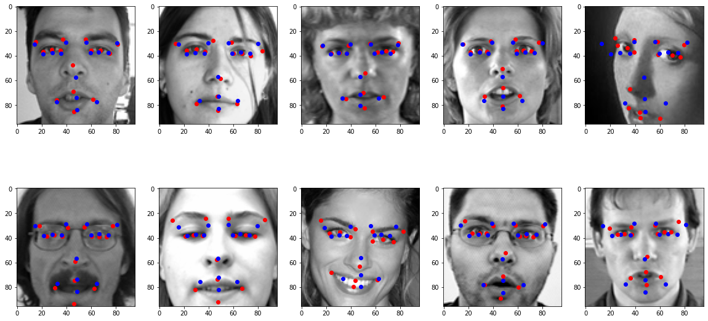
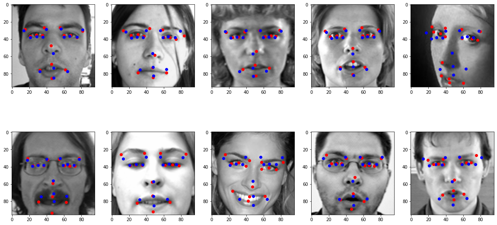
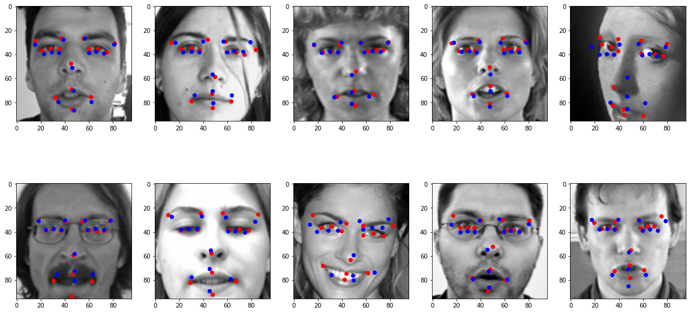

# kaggle_facial_keypoint_detection
Kaggle facial keypoint detection using pytorch lightning

---------
## Dataset
| |left_eye_center_x|left_eye_center_y |right_eye_center_x  |right_eye_center_y |... |Image|
|-|-----------------|------------------|--------------------|-------------------|----|-----|
|0|	66.033564	    |39.002274         |	30.227008       |	36.421678       |... |96*96 pixels|
|...|               |                  |                    |                   |    |      |
* columns
```Python
['left_eye_center_x', 'left_eye_center_y', 'right_eye_center_x',
    'right_eye_center_y', 'left_eye_inner_corner_x',
    'left_eye_inner_corner_y', 'left_eye_outer_corner_x',
    'left_eye_outer_corner_y', 'right_eye_inner_corner_x',
    'right_eye_inner_corner_y', 'right_eye_outer_corner_x',
    'right_eye_outer_corner_y', 'left_eyebrow_inner_end_x',
    'left_eyebrow_inner_end_y', 'left_eyebrow_outer_end_x',
    'left_eyebrow_outer_end_y', 'right_eyebrow_inner_end_x',
    'right_eyebrow_inner_end_y', 'right_eyebrow_outer_end_x',
    'right_eyebrow_outer_end_y', 'nose_tip_x', 'nose_tip_y',
    'mouth_left_corner_x', 'mouth_left_corner_y', 'mouth_right_corner_x',
    'mouth_right_corner_y', 'mouth_center_top_lip_x',
    'mouth_center_top_lip_y', 'mouth_center_bottom_lip_x',
    'mouth_center_bottom_lip_y', 'Image']
```
* 시각화

## Model  
* 이미지 픽셀 / 255(0~1)
* 데이터 증식 X
* loss : RMSE
* epoch : 50, 조기 종료 사용
### 1)  
* optimizer : <code>NAdam(lr=1e-3)</code>

|layer      |input           |output         |kernel size|padding|stride |activation            |
|-----------|----------------|---------------|-----------|-------|-------|----------------------|
|Conv2D     |1               |64             |7          |same   |1      |ReLU                  |
|MaxPooling |-               |-              |2          |valid  |2      |-                     |
|Conv2D     |64              |128            |3          |same   |1      |ReLU                  |
|Conv2D     |128             |128            |3          |same   |1      |ReLU                  |
|MaxPooling |-               |-              |2          |valid  |2      |-                     |
|Conv2D     |128             |256            |3          |same   |1      |ReLU                  |
|Conv2D     |256             |256            |3          |same   |1      |ReLU                  |
|MaxPooling |-               |-              |2          |valid  |2      |-                     |
|Conv2D     |256             |512            |3          |same   |1      |ReLU                  |
|Conv2D     |512             |512            |3          |same   |1      |ReLU                  |
|MaxPooling |-               |-              |2          |valid  |2      |-                     |
|Flatten    |-               |-              |-          |-      |-      |-                     |
|Linear     |*512\*5\*5*     |512            |-          |-      |-      |ReLU                  |
|Dropout    |-               |-              |-          |-      |-      |(p=0.5)               |
|Linear     |512             |256            |-          |-      |-      |ReLU                  |
|Dropout    |-               |-              |-          |-      |-      |(p=0.5)               |
|Linear     |256             |128            |-          |-      |-      |ReLU                  |
|Dropout    |-               |-              |-          |-      |-      |(p=0.5)               |
|Linear     |128             |30             |-          |-      |-      |*ScaledSigmoid*       |
> * 96\*96 크기 이미지 -> 5\*5크기 특성 맵 512개
> * ScaledSigmoid : 출력 범위가 0\~96으로 고정된 sigmoid
* validation set result

* validation loss : 3.057290
* kaggle test loss : 4.35620
### 2)  
* optimizer : <code>NAdam(lr=1e-3)</code>
* 매 convolutional layer 다음마다 batch normalization 적용

|layer      |input           |output         |kernel size|padding|stride |activation                            |
|-----------|----------------|---------------|-----------|-------|-------|--------------------------------------|
|Conv2D     |1               |32             |3          |same   |1      |LeakyReLU(negative_slope=0.1)         |
|Conv2D     |32              |32             |3          |same   |1      |LeakyReLU(negative_slope=0.1)         |
|MaxPooling |-               |-              |2          |valid  |2      |-                                     |
|Conv2D     |32              |64             |3          |same   |1      |LeakyReLU(negative_slope=0.1)         |
|Conv2D     |64              |64             |3          |same   |1      |LeakyReLU(negative_slope=0.1)         |
|MaxPooling |-               |-              |2          |valid  |2      |-                                     |
|Conv2D     |64              |96             |3          |same   |1      |LeakyReLU(negative_slope=0.1)         |
|Conv2D     |96              |96             |3          |same   |1      |LeakyReLU(negative_slope=0.1)         |
|MaxPooling |-               |-              |2          |valid  |2      |-                                     |
|Conv2D     |96              |128            |3          |same   |1      |LeakyReLU(negative_slope=0.1)         |
|Conv2D     |128             |128            |3          |same   |1      |LeakyReLU(negative_slope=0.1)         |
|MaxPooling |-               |-              |2          |valid  |2      |-                                     |
|Conv2D     |128             |256            |3          |same   |1      |LeakyReLU(negative_slope=0.1)         |
|Conv2D     |256             |256            |3          |same   |1      |LeakyReLU(negative_slope=0.1)         |
|MaxPooling |-               |-              |2          |valid  |2      |-                                     |
|Conv2D     |256             |512            |3          |same   |1      |LeakyReLU(negative_slope=0.1)         |
|Conv2D     |512             |512            |3          |same   |1      |LeakyReLU(negative_slope=0.1)         |
|Flatten    |-               |-              |-          |-      |-      |-                                     |
|Linear     |*512\*3\*3*     |512            |-          |-      |-      |ReLU                                  |
|Dropout    |-               |-              |-          |-      |-      |(p=0.5)                               |
|Linear     |512             |256            |-          |-      |-      |ReLU                                  |
|Dropout    |-               |-              |-          |-      |-      |(p=0.5)                               |
|Linear     |256             |128            |-          |-      |-      |ReLU                                  |
|Dropout    |-               |-              |-          |-      |-      |(p=0.5)                               |
|Linear     |128             |30             |-          |-      |-      |*ScaledSigmoid*                       |

* validation set result

* validation loss : 3.077158
* kaggle test loss : 4.42136
### 3)  
* pretrained ResNet50 사용
* optimizer : <code>NAdam(lr=1e-3)</code>
* learning rate scheduler(<code>ReduceLROnPlateau</code>) 사용

|layer       |input           |output         |kernel size|padding|stride |activation                            |
|------------|----------------|---------------|-----------|-------|-------|--------------------------------------|
|Conv2D      |1               |3              |1          |same   |1      |LeakyReLU(negative_slope=0.1)         |
|[resnet50]  |3               |2048           |-          |-      |-      |-                                     |
|Dropout     |-               |-              |-          |-      |-      |(p=0.1)                               |
|Linear      |2048            |512            |-          |-      |-      |ReLU                                  |
|Dropout     |-               |-              |-          |-      |-      |(p=0.5)                               |
|Linear      |512             |30             |-          |-      |-      |*ScaledSigmoid*                       |

* validation set result

* validation loss : 2.500764
* kaggle test loss : 4.05836